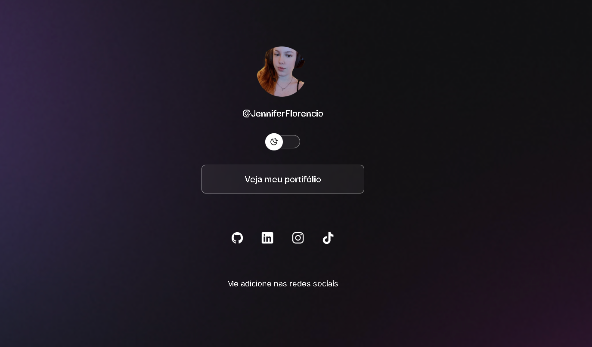

<h1 align="center"> Portifolio </h1>

Este é meu portfólio pessoal 

  <a href="#-tecnologias">Tecnologias</a>&nbsp;&nbsp;&nbsp;|&nbsp;&nbsp;&nbsp;
  <a href="#-projeto">Projeto</a>&nbsp;&nbsp;&nbsp;

 

  

## 🚀 Tecnologias

Esse projeto foi desenvolvido com as seguintes tecnologias:

- HTML e CSS
- JavaScript
- Git e Github

## 💻 Projeto

O objetivo é apresentar meus projetos, habilidades e informações de contato de forma moderna, acessível e responsiva.
